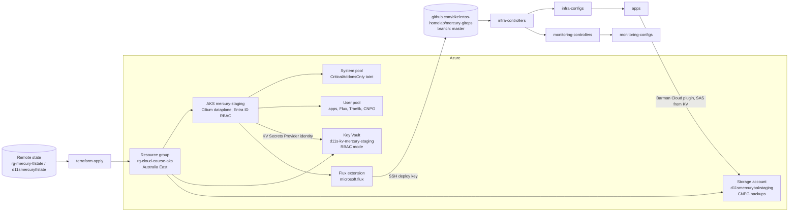

# mercury-workflows

Terraform for a small multi-tenant n8n platform on Azure Kubernetes Service (AKS), built phase by phase while working through the KubeCraft cloud course.

> **Credit where it's due:** this repo started as the course repo for **KubeCraft's _DevOps OS Part 2 / Kubernetes in the Cloud_** by **[Mischa van den Burg](https://github.com/mischavandenburg)**. The phase structure, most of the Terraform, and the course write-ups in each phase's README are his. I've worked through the phases on my own Azure subscription, and the changes I made are listed in [What I added / adapted](#what-i-added--adapted). It's a learning journey, not a product.

## What this is

"Mercury" is a pretend SaaS that runs one [n8n](https://n8n.io) workflow instance per customer. Each phase in the course adds one layer:

- a single VM, then reusable Terraform modules
- AKS with Cilium, then Key Vault + CSI, cert-manager and Traefik
- GitOps with the AKS Flux extension, pointed at **[mercury-gitops](https://github.com/dkelertas-homelab/mercury-gitops)**
- CloudNativePG (CNPG) databases backed up to Azure Blob with the Barman Cloud plugin
- AKS hardening (Entra ID, separate system and user pools, auto-upgrades, maintenance windows)
- Pod Security Standards `restricted`, Cilium network policies, probes and resource limits
- kube-prometheus-stack, with Grafana-native alerts sent to Telegram
- a `customer-onboarding` module that sets up a new tenant (blob container, Key Vault secrets, GitOps manifests) from a single list entry

My live config (`mercury-tf/`) runs in **Australia East** under the `d11s.space` domain. The cluster's CI/CD (validation, promotion, post-deploy health checks) lives in mercury-gitops: see its [CI/CD walkthrough](https://github.com/dkelertas-homelab/mercury-gitops/blob/master/docs/ci-cd-walkthrough.md).

## Architecture



## Repo layout

| Path | What's in it |
|------|--------------|
| `phase-1-vm/` | One Linux VM with VNet, NSG and public IP. Basic Terraform. |
| `phase-2-modules/` | `customer-infrastructure` module (VM + PostgreSQL Flexible Server per customer), used for two customers. |
| `phase-3-aks/` | First AKS cluster (Cilium) plus PostgreSQL Flexible Server; plain manifests in `manifests-v0`, `manifests-v1` and my own `manifests-v00`. |
| `phase-4-k8s-infra/` | Adds Key Vault and the AKS Key Vault Secrets Provider (CSI), cert-manager issuers, a CNPG example and n8n with an Ingress. |
| `phase-5-gitops/` | AKS Flux extension and `azurerm_kubernetes_flux_configuration`; random DB password stored in Key Vault. |
| `phase-6-cnpg/` | CNPG with a storage account and container for Barman backups; SAS token stored in Key Vault. |
| `phase-7-aks-hardening/` | Entra ID RBAC, system/user pool split, `patch` upgrade channel, `NodeImage` OS upgrades, Sunday maintenance windows. **Remote state in Azure Blob (added by me).** |
| `phase-8-production-n8n/` | GitOps-only: PSS `restricted`, read-only root FS, dropped capabilities, probes, limits, `CiliumNetworkPolicy`. |
| `phase-9-monitoring/` | kube-prometheus-stack plus Grafana alert rules (CNPG, DB, n8n, node, pod) sent to Telegram. |
| `phase-10-onboarding/` | `modules/customer-onboarding` plus `staging/` and `production/` roots. A `for_each` over a customer list creates the blob container, KV secrets and GitOps manifests (via `local_file`). |
| `mercury-tf/` | **My working area.** This is the config I actually run: phase-7 hardening plus the phase-9 monitoring Kustomizations and Grafana Key Vault secrets, localised. `staging/` is a work-in-progress copy that wires in the phase-10 onboarding module. |
| `backends/azure-blob.tfbackend` | Shared remote-state backend settings (Azure AD auth). Symlinked into `phase-7-aks-hardening/` and `mercury-tf/`. |
| `.devcontainer/`, `mise.toml`, `scripts/setup` | Dev container with terraform, kubectl, flux, helm, k9s, gh, az CLI and the `kubectl cnpg` plugin. |
| `CHANGELOG.md` | Course-author fixes (ingress class, CNPG host). |

Each phase folder has its own root module and is meant to be applied by itself. Later phases replace earlier ones; they don't stack.

## What I added / adapted

All of these show up in `git log` / `git diff` against the course's initial commit:

- **Localised**: phases 3–7 and `mercury-tf` moved from North Europe to **Australia East** on my own subscription (phases 1, 2, 9 and 10 still have the course regions). Hostnames use `*.mercury-staging.d11s.space`.
- **Globally unique names**: Key Vault `d11s-kv-mercury-staging`, backup storage `d11smercurybakstaging`, state storage `d11smercurytfstate`.
- **Newer Kubernetes**: AKS bumped from 1.32 to **1.34.7** (phases 5–7) and **1.34.10** (`mercury-tf`). Phases 3–4 were tried on 1.35.0. Phases 9–10 still have the course's 1.32.1.
- **Newer n8n**: 1.123.3 to **2.35.3**, done in mercury-gitops.
- **Remote state**: phase-7 and `mercury-tf` keep state in a separate `rg-mercury-tfstate` storage account (`use_azuread_auth = true`), so `terraform destroy` on the cluster can't take the state with it. Merged via PR #1.
- **Drift fixes**: `lifecycle { ignore_changes = [oidc_issuer_enabled, default_node_pool[0].upgrade_settings] }` on the `mercury-tf` clusters, so plans stop trying to flip settings AKS manages itself.
- **Flux pointed at my repo**: phases 5–7 and `mercury-tf` use `ssh://git@github.com/dkelertas-homelab/mercury-gitops`. Phases 6, 7 and `mercury-tf` track branch `master` (phase-5 still says `main`).
- **Sizing**: in `mercury-tf/staging`, the user pool is 2 nodes rather than the 4 in course phase-10, to keep the vCPU footprint small.
- **Phase 3 experiments**: my own `manifests-v00`, and a short-lived attempt at a private-endpoint PostgreSQL server (private DNS zone, public access off) that I later rolled back to public for the lab.

The GitOps-side work (CNPG restore drill, Barman `dependsOn` fix, ingress-class fix, secrets-bootstrap analysis, PSS/Cilium hardening, Telegram alerting) lives in **[mercury-gitops](https://github.com/dkelertas-homelab/mercury-gitops)**.

## How to run

Prerequisites: Azure subscription, `az login`, Terraform ≥ 1.0 (azurerm ~> 4.0), and an SSH key at `~/.ssh/mercury` whose public half is a deploy key on mercury-gitops.

```bash
# one-off: Flux extension provider
az provider register --namespace Microsoft.KubernetesConfiguration

# deploy key for Flux (phase-5 README)
ssh-keygen -t ed25519 -f ~/.ssh/mercury -N "" -C "mercury-gitops-deploy-key"
gh repo deploy-key add ~/.ssh/mercury.pub --repo dkelertas-homelab/mercury-gitops --title flux-deploy-key

# any self-contained phase
cd phase-6-cnpg && terraform init && terraform apply

# phases with remote state (phase-7, mercury-tf)
cd mercury-tf
terraform init -backend-config=azure-blob.tfbackend   # needs Storage Blob Data Contributor
terraform apply

# get credentials (Entra ID cluster) and watch Flux
az aks get-credentials -g rg-cloud-course-aks -n mercury-staging
kubelogin convert-kubeconfig -l azurecli
flux get kustomizations -A
```

Each apply creates billable AKS nodes, so I run `terraform destroy` (or `az aks stop`) when I'm finished. Remote state survives the destroy.

## Lessons / gotchas

- **Some AKS changes rebuild the whole cluster.** Renaming the default pool or setting `only_critical_addons_enabled` can only happen at create time, so phase-7 recreates the cluster. Keeping state outside the cluster's resource group made this painless.
- **Every new cluster gets a new Key Vault CSI identity.** After recreating the cluster, `terraform output aks_keyvault_secrets_provider_client_id` has to be copied into the SecretProviderClass patches in mercury-gitops. If it isn't, mounts fail with `Identity not found`.
- **Flux extension vs tainted system pool.** The extension must `depends_on` the user node pool, or it has nowhere to schedule.
- **Secrets chicken-and-egg.** CSI `secretObjects` only create Kubernetes Secrets once a pod mounts the volume, but CNPG needs the DB credentials Secret *before* `initdb`. See the [secrets-bootstrap analysis](https://github.com/dkelertas-homelab/mercury-gitops/tree/master/docs/sketches/secrets-bootstrap) (ESO vs a sync Job).
- **Default branch names matter.** Course code assumes `main`; my repo is `master`, and Flux quietly syncs nothing until `reference_value` matches.
- **Global names collide.** Key Vault and storage account names are globally unique, so the course defaults were already taken.
- **AKS settings fight Terraform.** AKS manages OIDC and upgrade settings itself, and without `ignore_changes` every plan shows noise.

## Security note

- The early course phases (2–4) contain **demo-only PostgreSQL passwords** for a throwaway lab, some from the course and some from my own early commits. They're still in the Git history and were never used anywhere else.
- The phase-9 README example used to include a Telegram bot token. I replaced it (and the chat ID) with placeholders in PR #2 and revoked the old token, so the copy left in history is dead.
- From phase-5 on, credentials are generated with `random_password`, stored in **Azure Key Vault**, and reach pods through the Key Vault CSI driver. No real secret values are committed for the current setup.
- Azure subscription/tenant IDs, managed-identity client IDs and Telegram chat IDs do appear in config. They're identifiers, not credentials.
- `*.tfvars`, state files and deploy keys are git-ignored.

## Related

- **[mercury-gitops](https://github.com/dkelertas-homelab/mercury-gitops)**: the Flux repo this Terraform points at, with GitHub Actions validation, dev → prod promotion and post-deploy health checks ([CI/CD walkthrough](https://github.com/dkelertas-homelab/mercury-gitops/blob/master/docs/ci-cd-walkthrough.md)).
- **[d11s.space](https://d11s.space)**: my blog, with write-ups on this homelab.
- **KubeCraft** community and course by Mischa van den Burg: thanks for a great hands-on curriculum.
